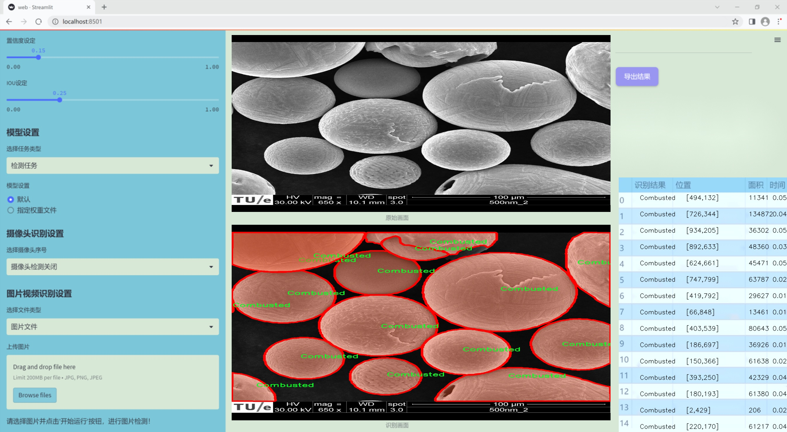
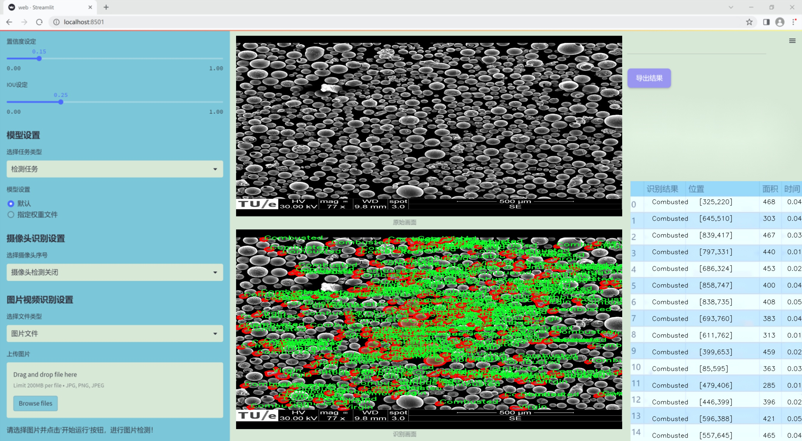
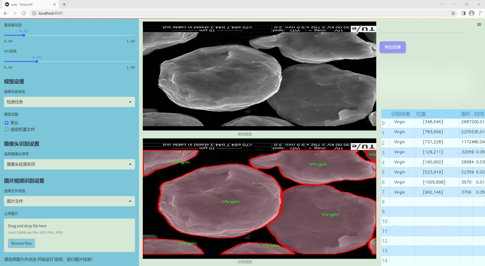
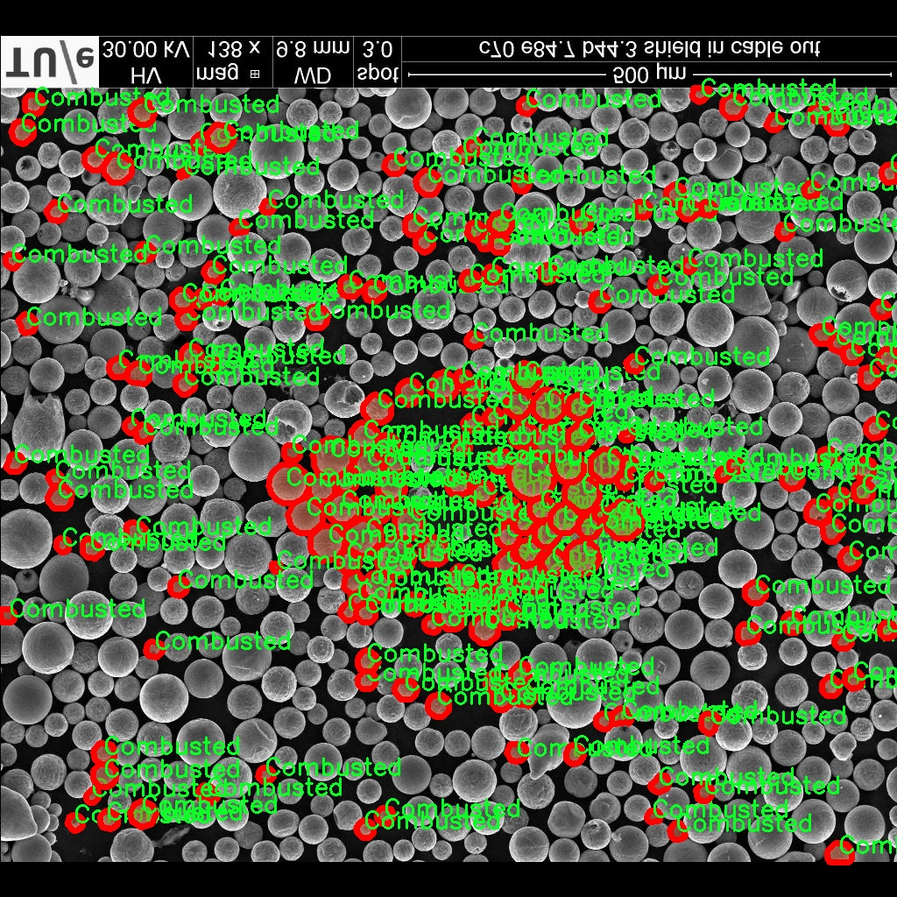
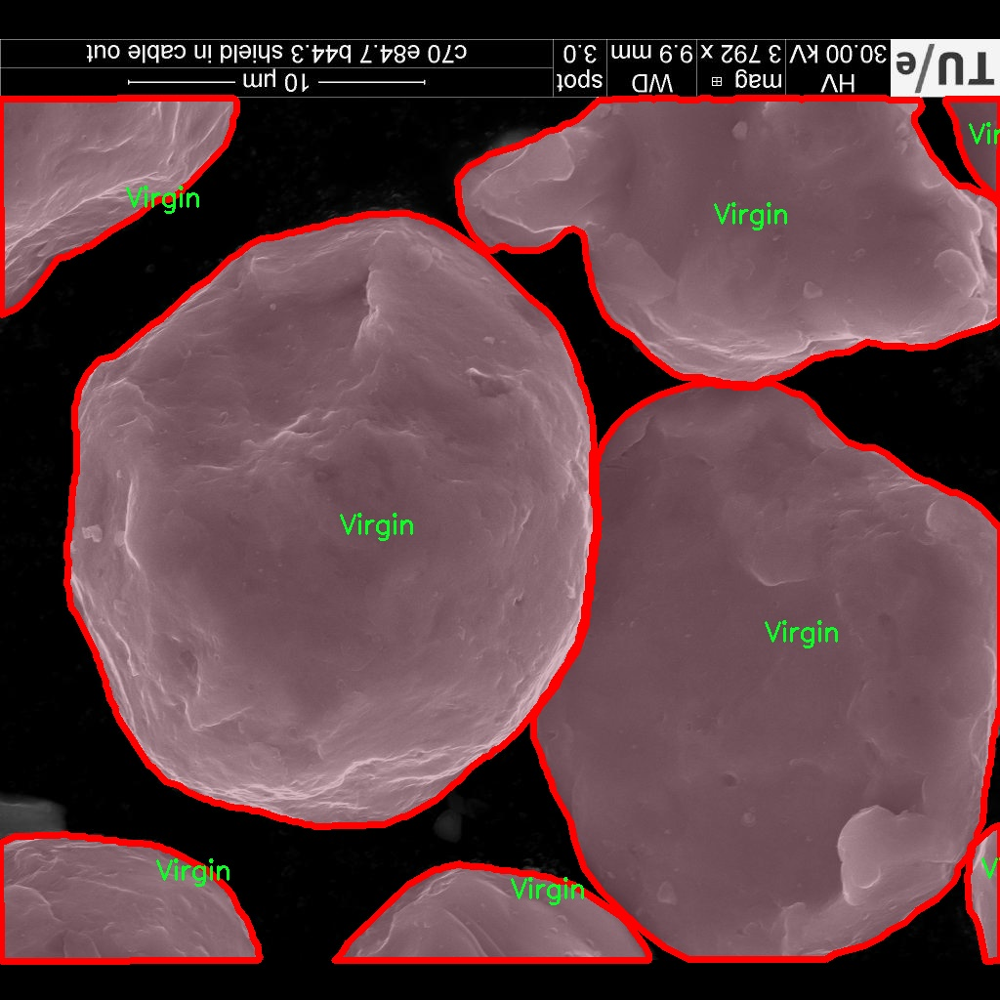
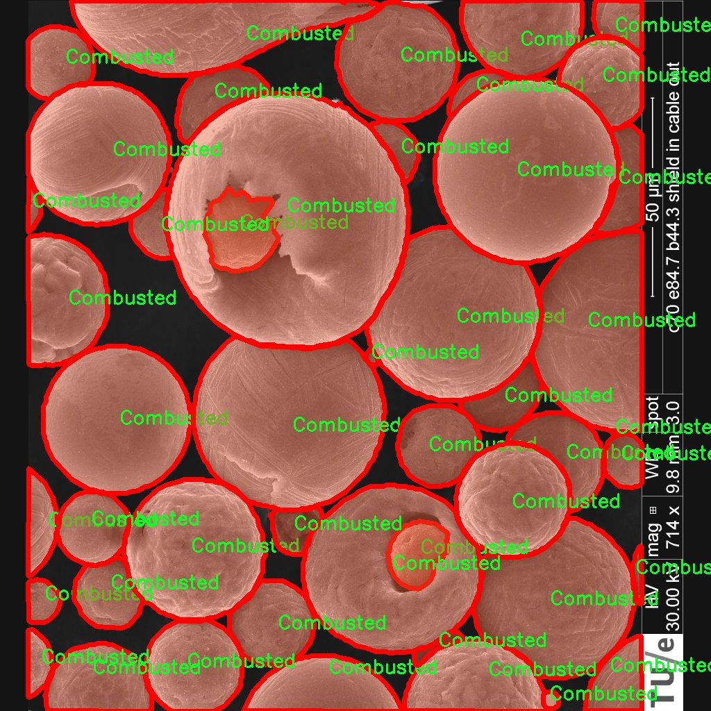
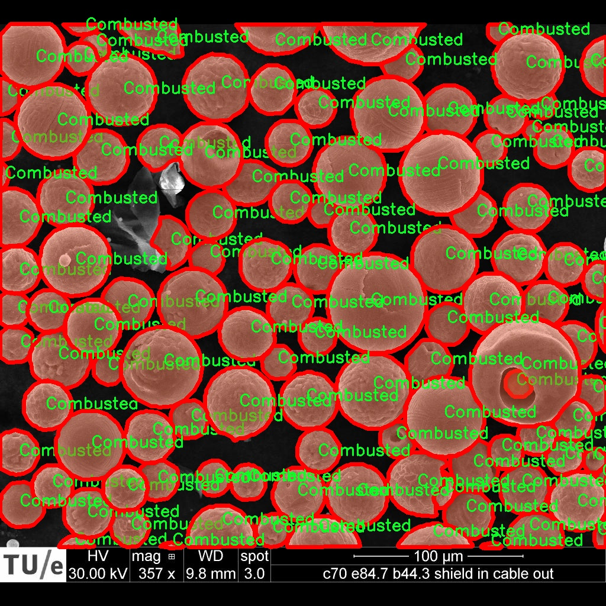
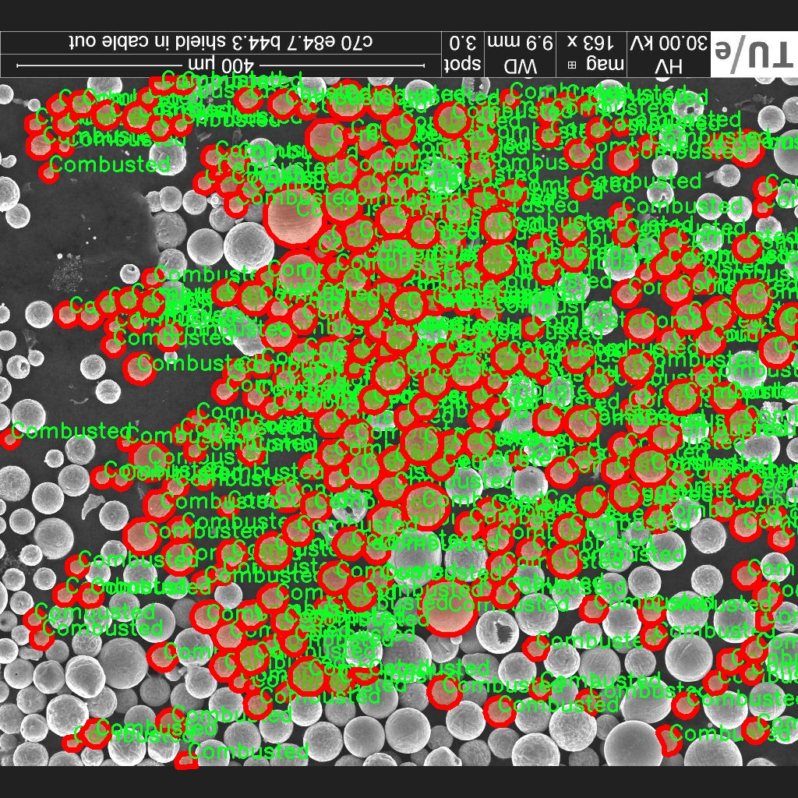

### 1.背景意义

研究背景与意义

随着工业化进程的加快，铁粉在多个领域中的应用日益广泛，包括金属增材制造、催化剂和粉末冶金等。然而，铁粉的状态对其性能和应用效果具有重要影响。铁粉的状态主要分为三类：燃烧状态（Combusted）、还原状态（Reduced）和原始状态（Virgin）。这三种状态的铁粉在物理和化学性质上存在显著差异，因此，准确检测和分类铁粉的状态成为了工业生产中的一项重要任务。

传统的铁粉状态检测方法往往依赖于人工观察和实验室分析，不仅耗时耗力，而且容易受到人为因素的影响，导致检测结果的不准确性。随着计算机视觉技术的迅猛发展，基于深度学习的自动化检测方法逐渐成为研究热点。YOLO（You Only Look Once）系列算法因其高效的实时检测能力，广泛应用于目标检测任务中。然而，现有的YOLO版本在处理特定领域数据时，仍存在一定的局限性，尤其是在小样本数据集上，模型的泛化能力和准确性有待提高。

本研究旨在基于改进的YOLOv11算法，构建一个高效的铁粉状态检测系统。通过对126张经过精心标注的图像进行训练，该系统将能够实现对铁粉状态的自动识别与分类。数据集的多样性和丰富的图像增强技术将为模型的训练提供坚实的基础，确保其在实际应用中的可靠性和准确性。此外，研究成果不仅可以提高铁粉的检测效率，还能为相关行业提供科学依据，推动智能制造和工业自动化的发展。因此，基于改进YOLOv11的铁粉状态检测系统的研究具有重要的理论意义和广泛的应用前景。

### 2.视频效果

[2.1 视频效果](https://www.bilibili.com/video/BV1xeU6YXEvM/)

### 3.图片效果







##### [项目涉及的源码数据来源链接](https://kdocs.cn/l/cszuIiCKVNis)**

注意：本项目提供训练的数据集和训练教程,由于版本持续更新,暂不提供权重文件（best.pt）,请按照6.训练教程进行训练后实现上图演示的效果。

### 4.数据集信息

##### 4.1 本项目数据集类别数＆类别名

nc: 3
names: ['Combusted', 'Reduced', 'Virgin']


该项目为【图像分割】数据集，请在【训练教程和Web端加载模型教程（第三步）】这一步的时候按照【图像分割】部分的教程来训练

##### 4.2 本项目数据集信息介绍

本项目数据集信息介绍

本项目旨在改进YOLOv11模型，以实现对铁粉状态的高效检测。为此，我们构建了一个专门的数据集，涵盖了铁粉的三种主要状态：燃烧状态（Combusted）、还原状态（Reduced）和原始状态（Virgin）。该数据集的设计考虑了不同状态下铁粉的物理特性和外观特征，确保能够为模型提供丰富且多样化的训练样本。

在数据集的构建过程中，我们收集了大量来自不同来源的铁粉图像，确保每种状态的样本数量均衡。每个类别的图像均经过精心挑选和标注，以确保数据的准确性和可靠性。燃烧状态的铁粉图像展示了铁粉在高温环境下的变化，可能呈现出不同的颜色和形态；而还原状态的铁粉则反映了经过化学还原处理后的特征，通常具有较为均匀的颗粒分布；原始状态的铁粉则是未经处理的自然状态，展现出其原始的物理特性。

数据集中包含的图像不仅涵盖了不同的光照条件和背景环境，还包括了不同粒径和形状的铁粉样本。这种多样性有助于模型在实际应用中更好地适应各种复杂情况，提高其鲁棒性和准确性。此外，为了增强模型的泛化能力，我们还对图像进行了数据增强处理，包括旋转、缩放和颜色调整等操作。

通过对该数据集的训练，改进后的YOLOv11模型将能够更准确地识别和分类铁粉的不同状态，为工业应用中的铁粉监测和管理提供有效的技术支持。这一数据集的构建不仅为研究提供了基础数据，也为后续的模型优化和应用探索奠定了坚实的基础。











### 5.全套项目环境部署视频教程（零基础手把手教学）

[5.1 所需软件PyCharm和Anaconda安装教程（第一步）](https://www.bilibili.com/video/BV1BoC1YCEKi/?spm_id_from=333.999.0.0&vd_source=bc9aec86d164b67a7004b996143742dc)


[5.2 安装Python虚拟环境创建和依赖库安装视频教程（第二步）](https://www.bilibili.com/video/BV1ZoC1YCEBw?spm_id_from=333.788.videopod.sections&vd_source=bc9aec86d164b67a7004b996143742dc)

### 6.改进YOLOv11训练教程和Web_UI前端加载模型教程（零基础手把手教学）

[6.1 改进YOLOv11训练教程和Web_UI前端加载模型教程（第三步）](https://www.bilibili.com/video/BV1BoC1YCEhR?spm_id_from=333.788.videopod.sections&vd_source=bc9aec86d164b67a7004b996143742dc)


按照上面的训练视频教程链接加载项目提供的数据集，运行train.py即可开始训练



     Epoch   gpu_mem       box       obj       cls    labels  img_size
     1/200     20.8G   0.01576   0.01955  0.007536        22      1280: 100%|██████████| 849/849 [14:42<00:00,  1.04s/it]
               Class     Images     Labels          P          R     mAP@.5 mAP@.5:.95: 100%|██████████| 213/213 [01:14<00:00,  2.87it/s]
                 all       3395      17314      0.994      0.957      0.0957      0.0843

     Epoch   gpu_mem       box       obj       cls    labels  img_size
     2/200     20.8G   0.01578   0.01923  0.007006        22      1280: 100%|██████████| 849/849 [14:44<00:00,  1.04s/it]
               Class     Images     Labels          P          R     mAP@.5 mAP@.5:.95: 100%|██████████| 213/213 [01:12<00:00,  2.95it/s]
                 all       3395      17314      0.996      0.956      0.0957      0.0845

     Epoch   gpu_mem       box       obj       cls    labels  img_size
     3/200     20.8G   0.01561    0.0191  0.006895        27      1280: 100%|██████████| 849/849 [10:56<00:00,  1.29it/s]
               Class     Images     Labels          P          R     mAP@.5 mAP@.5:.95: 100%|███████   | 187/213 [00:52<00:00,  4.04it/s]
                 all       3395      17314      0.996      0.957      0.0957      0.0845


###### [项目数据集下载链接](https://kdocs.cn/l/cszuIiCKVNis)

### 7.原始YOLOv11算法讲解

YOLO11采用改进的骨干和颈部架构，增强了特征提取能力，提高了物体检测的精确度和复杂任务的表现。YOLO11引入精炼的架构设计和优化的训练流程，实现更快的处理速度，同时保持精度和性能之间的最佳平衡。通过模型设计的进步，YOLO11m在COCO数据集上实现了更高的均值平均精度（mAP），同时使用比YOLOv8m少22%的参数，使其在不妥协准确性的情况下更加计算高效。YOLO11可以无缝部署在各种环境中，包括边缘设备、云平台以及支持NVIDIA
GPU的系统，确保最大灵活性。无论是物体检测、实例分割、图像分类、姿态估计，还是定向物体检测（OBB），YOLO11都旨在应对多样的计算机视觉挑战。


##### **Ultralytics YOLO11相比于之前版本的主要改进有哪些？**

Ultralytics YOLO11在其前身基础上引入了几项重要进步。主要改进包括：

  1. **增强的特征提取** ：YOLO11采用改进的骨干和颈部架构，增强了特征提取能力，提高了物体检测的精确度。
  2.  **优化的效率和速度** ：精炼的架构设计和优化的训练流程实现了更快的处理速度，同时保持了准确性和性能之间的平衡。
  3.  **更高的准确性与更少的参数** ：YOLO11m在COCO数据集上实现了更高的均值平均精度（mAP），同时使用比YOLOv8m少22%的参数，使其在不妥协准确性的情况下更加计算高效。
  4.  **环境适应性强** ：YOLO11可以在多种环境中部署，包括边缘设备、云平台以及支持NVIDIA GPU的系统。
  5.  **支持广泛的任务** ：YOLO11支持多种计算机视觉任务，如物体检测、实例分割、图像分类、姿态估计和定向物体检测（OBB）。

我们先来看一下其网络结构有什么变化，可以看出，相比较于YOLOv8模型，其将CF2模块改成C3K2，同时在SPPF模块后面添加了一个C2PSA模块，且将YOLOv10的head思想引入到YOLO11的head中，使用深度可分离的方法，减少冗余计算，提高效率。下面我们来详细看一下这两个模块的结构是怎么构成的，以及它们为什么要这样设计


##### C3K2的网络结构

从下面图中我们可以看到，C3K2模块其实就是C2F模块转变出来的，它代码中有一个设置，就是当c3k这个参数为FALSE的时候，C3K2模块就是C2F模块，也就是说它的Bottleneck是普通的Bottleneck；反之当它为true的时候，将Bottleneck模块替换成C3模块。


##### C2PSA的网络结构

` `C2PSA是对 `C2f` 模块的扩展，它结合了PSA(Pointwise Spatial
Attention)块，用于增强特征提取和注意力机制。通过在标准 `C2f` 模块中引入 PSA
块，C2PSA实现了更强大的注意力机制，从而提高了模型对重要特征的捕捉能力。


##### **C2f 模块回顾：**

**** C2f模块是一个更快的 CSP（Cross Stage Partial）瓶颈实现，它通过两个卷积层和多个 Bottleneck
块进行特征提取。相比传统的 CSPNet，C2f 优化了瓶颈层的结构，使得计算速度更快。在 C2f中，`cv1` 是第一个 1x1
卷积，用于减少通道数；`cv2` 是另一个 1x1 卷积，用于恢复输出通道数。而 `n` 是一个包含 Bottleneck 块的数量，用于提取特征。

##### **C2PSA 模块的增强** ：

**C2PSA** 扩展了 C2f，通过引入PSA( **Position-Sensitive Attention)**
，旨在通过多头注意力机制和前馈神经网络来增强特征提取能力。它可以选择性地添加残差结构（shortcut）以优化梯度传播和网络训练效果。同时，使用FFN
可以将输入特征映射到更高维的空间，捕获输入特征的复杂非线性关系，允许模型学习更丰富的特征表示。

##### head部分

YOLO11在head部分的cls分支上使用深度可分离卷积 ，具体代码如下，cv2边界框回归分支，cv3分类分支。

    
    
     self.cv2 = nn.ModuleList(
                nn.Sequential(Conv(x, c2, 3), Conv(c2, c2, 3), nn.Conv2d(c2, 4 * self.reg_max, 1)) for x in ch
            )
            self.cv3 = nn.ModuleList(
                nn.Sequential(
                    nn.Sequential(DWConv(x, x, 3), Conv(x, c3, 1)),
                    nn.Sequential(DWConv(c3, c3, 3), Conv(c3, c3, 1)),
                    nn.Conv2d(c3, self.nc, 1),
                )
                for x in ch
            )


### 8.200+种全套改进YOLOV11创新点原理讲解

#### 8.1 200+种全套改进YOLOV11创新点原理讲解大全

由于篇幅限制，每个创新点的具体原理讲解就不全部展开，具体见下列网址中的改进模块对应项目的技术原理博客网址【Blog】（创新点均为模块化搭建，原理适配YOLOv5~YOLOv11等各种版本）

[改进模块技术原理博客【Blog】网址链接](https://gitee.com/qunmasj/good)


#### 8.2 精选部分改进YOLOV11创新点原理讲解

###### 这里节选部分改进创新点展开原理讲解(完整的改进原理见上图和[改进模块技术原理博客链接](https://gitee.com/qunmasj/good)【如果此小节的图加载失败可以通过CSDN或者Github搜索该博客的标题访问原始博客，原始博客图片显示正常】

### RT-DETR骨干网络HGNetv2简介
#### RT-DETR横空出世
前几天被百度的RT-DETR刷屏，参考该博客提出的目标检测新范式对原始DETR的网络结构进行了调整和优化，以提高计算速度和减小模型大小。这包括使用更轻量级的基础网络和调整Transformer结构。并且，摒弃了nms处理的detr结构与传统的物体检测方法相比，不仅训练是端到端的，检测也能端到端，这意味着整个网络在训练过程中一起进行优化，推理过程不需要昂贵的后处理代价，这有助于提高模型的泛化能力和性能。


当然，人们对RT-DETR之所以产生浓厚的兴趣，我觉得大概率还是对YOLO系列审美疲劳了，就算是出到了YOLO10086，我还是只想用YOLOv11和YOLOv11的框架来魔改做业务。。

#### 初识HGNet
看到RT-DETR的性能指标，发现指标最好的两个模型backbone都是用的HGNetv2，毫无疑问，和当时的picodet一样，骨干都是使用百度自家的网络。初识HGNet的时候，当时是参加了第四届百度网盘图像处理大赛，文档图像方向识别专题赛道，简单来说，就是使用分类网络对一些文档截图或者图片进行方向角度分类。


当时的方案并没有那么快定型，通常是打榜过程发现哪个网络性能好就使用哪个网络做魔改，而且木有显卡，只能蹭Ai Studio的平台，不过v100一天8小时的实验时间有点短，这也注定了大模型用不了。 

流水的模型，铁打的炼丹人，最后发现HGNet-tiny各方面指标都很符合我们的预期，后面就一直围绕它魔改。当然，比赛打榜是目的，学习才是享受过程，当时看到效果还可以，便开始折腾起了HGNet的网络架构，我们可以看到，PP-HGNet 针对 GPU 设备，对目前 GPU 友好的网络做了分析和归纳，尽可能多的使用 3x3 标准卷积（计算密度最高），PP-HGNet是由多个HG-Block组成，细节如下：


ConvBNAct是啥？简单聊一聊，就是Conv+BN+Act，CV Man应该最熟悉不过了：
```python
class ConvBNAct(TheseusLayer):
    def __init__(self,
                 in_channels,
                 out_channels,
                 kernel_size,
                 stride,
                 groups=1,
                 use_act=True):
        super().__init__()
        self.use_act = use_act
        self.conv = Conv2D(
            in_channels,
            out_channels,
            kernel_size,
            stride,
            padding=(kernel_size - 1) // 2,
            groups=groups,
            bias_attr=False)
        self.bn = BatchNorm2D(
            out_channels,
            weight_attr=ParamAttr(regularizer=L2Decay(0.0)),
            bias_attr=ParamAttr(regularizer=L2Decay(0.0)))
        if self.use_act:
            self.act = ReLU()
 
    def forward(self, x):
        x = self.conv(x)
        x = self.bn(x)
        if self.use_act:
            x = self.act(x)
        return x 
```
且标准卷积的数量随层数深度增加而增多，从而得到一个有利于 GPU 推理的骨干网络，同样速度下，精度也超越其他 CNN ，性价比也优于ViT-base模型。


另外，我们可以看到：

PP-HGNet 的第一层由channel为96的Stem模块构成，目的是为了减少参数量和计算量。PP-HGNet

Tiny的整体结构由四个HG Stage构成，而每个HG Stage主要由包含大量标准卷积的HG Block构成。

PP-HGNet的第三到第五层使用了使用了可学习的下采样层（LDS Layer），该层group为输入通道数，可达到降参降计算量的作用，且Tiny模型仅包含三个LDS Layer，并不会对GPU的利用率造成较大影响.

PP-HGNet的激活函数为Relu，常数级操作可保证该模型在硬件上的推理速度。

### 9.系统功能展示

图9.1.系统支持检测结果表格显示

  图9.2.系统支持置信度和IOU阈值手动调节

  图9.3.系统支持自定义加载权重文件best.pt(需要你通过步骤5中训练获得)

  图9.4.系统支持摄像头实时识别

  图9.5.系统支持图片识别

  图9.6.系统支持视频识别

  图9.7.系统支持识别结果文件自动保存

  图9.8.系统支持Excel导出检测结果数据


### 10. YOLOv11核心改进源码讲解

#### 10.1 test_selective_scan_speed.py

以下是经过精简和注释的核心代码部分，保留了主要功能和结构，同时提供了详细的中文注释。

```python
import torch
import torch.nn.functional as F
from einops import rearrange

def build_selective_scan_fn(selective_scan_cuda: object = None, mode="mamba_ssm"):
    """
    构建选择性扫描函数
    :param selective_scan_cuda: CUDA实现的选择性扫描
    :param mode: 模式选择
    :return: 选择性扫描函数
    """
    
    class SelectiveScanFn(torch.autograd.Function):
        @staticmethod
        def forward(ctx, u, delta, A, B, C, D=None, z=None, delta_bias=None, delta_softplus=False, return_last_state=False):
            """
            前向传播
            :param ctx: 上下文对象，用于保存信息
            :param u: 输入张量
            :param delta: 增量张量
            :param A, B, C: 参数张量
            :param D: 可选的额外参数
            :param z: 可选的张量
            :param delta_bias: 增量偏置
            :param delta_softplus: 是否使用softplus激活
            :param return_last_state: 是否返回最后状态
            :return: 输出张量或输出和最后状态
            """
            # 确保输入张量是连续的
            u = u.contiguous() if u.stride(-1) != 1 else u
            delta = delta.contiguous() if delta.stride(-1) != 1 else delta
            B = B.contiguous() if B.stride(-1) != 1 else B
            C = C.contiguous() if C.stride(-1) != 1 else C
            if D is not None:
                D = D.contiguous()

            # 处理张量维度
            if B.dim() == 3:
                B = rearrange(B, "b dstate l -> b 1 dstate l")
                ctx.squeeze_B = True
            if C.dim() == 3:
                C = rearrange(C, "b dstate l -> b 1 dstate l")
                ctx.squeeze_C = True

            # 调用CUDA实现的前向函数
            out, x, *rest = selective_scan_cuda.fwd(u, delta, A, B, C, D, z, delta_bias, delta_softplus)

            # 保存上下文
            ctx.save_for_backward(u, delta, A, B, C, D, z, delta_bias, x)
            last_state = x[:, :, -1, 1::2]  # 获取最后状态
            return (out, last_state) if return_last_state else out

        @staticmethod
        def backward(ctx, dout):
            """
            反向传播
            :param ctx: 上下文对象
            :param dout: 输出的梯度
            :return: 输入的梯度
            """
            u, delta, A, B, C, D, z, delta_bias, x = ctx.saved_tensors
            dout = dout.contiguous() if dout.stride(-1) != 1 else dout
            
            # 调用CUDA实现的反向函数
            du, ddelta, dA, dB, dC, dD, ddelta_bias, *rest = selective_scan_cuda.bwd(
                u, delta, A, B, C, D, z, delta_bias, dout, x, None, False
            )

            # 返回梯度
            return du, ddelta, dA, dB, dC, dD, None, ddelta_bias, None

    def selective_scan_fn(u, delta, A, B, C, D=None, z=None, delta_bias=None, delta_softplus=False, return_last_state=False):
        """
        封装选择性扫描函数
        """
        return SelectiveScanFn.apply(u, delta, A, B, C, D, z, delta_bias, delta_softplus, return_last_state)

    return selective_scan_fn

def selective_scan_ref(u, delta, A, B, C, D=None, z=None, delta_bias=None, delta_softplus=False, return_last_state=False):
    """
    参考实现的选择性扫描
    :param u: 输入张量
    :param delta: 增量张量
    :param A, B, C: 参数张量
    :param D: 可选的额外参数
    :param z: 可选的张量
    :param delta_bias: 增量偏置
    :param delta_softplus: 是否使用softplus激活
    :param return_last_state: 是否返回最后状态
    :return: 输出张量或输出和最后状态
    """
    # 将输入转换为浮点数
    u = u.float()
    delta = delta.float()
    if delta_bias is not None:
        delta += delta_bias[..., None].float()
    if delta_softplus:
        delta = F.softplus(delta)

    # 初始化状态
    batch, dim, dstate = u.shape[0], A.shape[0], A.shape[1]
    x = A.new_zeros((batch, dim, dstate))
    ys = []

    # 计算状态更新
    for i in range(u.shape[2]):
        x = torch.exp(delta) * x + B * u[:, :, i]
        y = torch.einsum('bdn,dn->bd', x, C)
        ys.append(y)

    # 输出结果
    out = torch.stack(ys, dim=2)
    return out if not return_last_state else (out, x)

# 下面的代码可以用于测试或调用
# 省略了具体的测试函数和实现细节
```

### 代码说明：
1. **build_selective_scan_fn**: 构建选择性扫描函数，返回一个可以用于前向和反向传播的函数。
2. **SelectiveScanFn**: 继承自`torch.autograd.Function`，实现了前向和反向传播的逻辑。
3. **forward**: 处理输入数据，调用CUDA实现的前向函数，并保存必要的上下文信息。
4. **backward**: 处理梯度计算，调用CUDA实现的反向函数，并返回输入的梯度。
5. **selective_scan_ref**: 参考实现的选择性扫描，提供了一个简单的实现以供对比。

该代码实现了选择性扫描的核心逻辑，并通过CUDA加速来提高性能。

这个文件 `test_selective_scan_speed.py` 是一个用于测试选择性扫描（Selective Scan）算法性能的脚本，主要使用 PyTorch 框架实现。代码中定义了多个函数和类，涉及到前向传播和反向传播的实现，以及性能测试。以下是对代码的逐步分析和说明。

首先，代码导入了一些必要的库，包括 `torch`、`torch.nn.functional`、`pytest`、`time` 等。然后定义了一个函数 `build_selective_scan_fn`，该函数用于构建选择性扫描的前向和反向传播函数。这个函数接受一个 CUDA 实现的选择性扫描函数和一些其他参数，并返回一个可调用的选择性扫描函数。

在 `build_selective_scan_fn` 函数内部，定义了一个名为 `SelectiveScanFn` 的类，该类继承自 `torch.autograd.Function`。这个类实现了前向传播和反向传播的静态方法。

在 `forward` 方法中，首先对输入张量进行连续性检查，并确保它们的维度和数据类型符合要求。接着，根据不同的模式（如 `mamba_ssm`、`sscore` 等）调用相应的 CUDA 实现进行前向计算。最后，保存输入张量和计算结果以便在反向传播中使用。

`backward` 方法则负责计算梯度。它根据前向传播中保存的上下文信息，调用相应的 CUDA 实现来计算输入张量的梯度，并返回这些梯度。

接下来，定义了一个名为 `selective_scan_ref` 的函数，这是一个参考实现，用于进行选择性扫描的计算。该函数实现了选择性扫描的核心逻辑，包括对输入张量的处理、状态更新和输出计算。

之后，定义了两个选择性扫描的简化版本 `selective_scan_easy` 和 `selective_scan_easy_v2`，这两个函数实现了类似的功能，但在实现上有所不同，主要是为了优化性能。

在文件的最后部分，定义了一个 `test_speed` 函数，该函数用于测试不同选择性扫描实现的性能。通过多次调用不同的选择性扫描函数，记录每次调用的时间，计算前向和反向传播的速度。测试中使用了多种参数配置，包括数据类型、序列长度、批量大小等，以评估不同情况下的性能表现。

总体来说，这个文件的主要目的是实现选择性扫描算法的高效计算，并通过性能测试来比较不同实现的速度。代码结构清晰，功能划分明确，适合在深度学习模型中进行时间序列数据的处理。

#### 10.2 RFAConv.py

以下是代码中最核心的部分，并附上详细的中文注释：

```python
import torch
import torch.nn as nn
from einops import rearrange

class RFAConv(nn.Module):
    def __init__(self, in_channel, out_channel, kernel_size, stride=1):
        super().__init__()
        self.kernel_size = kernel_size

        # 用于获取权重的网络，首先进行平均池化，然后通过1x1卷积生成权重
        self.get_weight = nn.Sequential(
            nn.AvgPool2d(kernel_size=kernel_size, padding=kernel_size // 2, stride=stride),
            nn.Conv2d(in_channel, in_channel * (kernel_size ** 2), kernel_size=1, groups=in_channel, bias=False)
        )
        
        # 生成特征的网络，通过卷积、批归一化和ReLU激活
        self.generate_feature = nn.Sequential(
            nn.Conv2d(in_channel, in_channel * (kernel_size ** 2), kernel_size=kernel_size, padding=kernel_size // 2, stride=stride, groups=in_channel, bias=False),
            nn.BatchNorm2d(in_channel * (kernel_size ** 2)),
            nn.ReLU()
        )
        
        # 最终的卷积层
        self.conv = nn.Conv2d(in_channel, out_channel, kernel_size=kernel_size, stride=kernel_size)

    def forward(self, x):
        b, c = x.shape[0:2]  # 获取输入的批量大小和通道数
        weight = self.get_weight(x)  # 获取权重
        h, w = weight.shape[2:]  # 获取特征图的高和宽
        
        # 对权重进行softmax归一化
        weighted = weight.view(b, c, self.kernel_size ** 2, h, w).softmax(2)  # b c*kernel**2, h, w
        
        # 生成特征并调整形状
        feature = self.generate_feature(x).view(b, c, self.kernel_size ** 2, h, w)  # b c*kernel**2, h, w
        
        # 加权特征
        weighted_data = feature * weighted
        
        # 重新排列特征图的形状
        conv_data = rearrange(weighted_data, 'b c (n1 n2) h w -> b c (h n1) (w n2)', n1=self.kernel_size, n2=self.kernel_size)
        
        return self.conv(conv_data)  # 返回卷积结果

class SE(nn.Module):
    def __init__(self, in_channel, ratio=16):
        super(SE, self).__init__()
        self.gap = nn.AdaptiveAvgPool2d((1, 1))  # 全局平均池化
        self.fc = nn.Sequential(
            nn.Linear(in_channel, ratio, bias=False),  # 从 c -> c/r
            nn.ReLU(),
            nn.Linear(ratio, in_channel, bias=False),  # 从 c/r -> c
            nn.Sigmoid()
        )

    def forward(self, x):
        b, c = x.shape[0:2]  # 获取输入的批量大小和通道数
        y = self.gap(x).view(b, c)  # 进行全局平均池化并调整形状
        y = self.fc(y).view(b, c, 1, 1)  # 通过全连接层
        return y  # 返回通道注意力

class RFCBAMConv(nn.Module):
    def __init__(self, in_channel, out_channel, kernel_size=3, stride=1):
        super().__init__()
        self.kernel_size = kernel_size
        
        # 生成特征的网络
        self.generate = nn.Sequential(
            nn.Conv2d(in_channel, in_channel * (kernel_size ** 2), kernel_size, padding=kernel_size // 2, stride=stride, groups=in_channel, bias=False),
            nn.BatchNorm2d(in_channel * (kernel_size ** 2)),
            nn.ReLU()
        )
        
        # 用于获取权重的网络
        self.get_weight = nn.Sequential(nn.Conv2d(2, 1, kernel_size=3, padding=1, bias=False), nn.Sigmoid())
        self.se = SE(in_channel)  # 通道注意力模块

        # 最终的卷积层
        self.conv = nn.Conv2d(in_channel, out_channel, kernel_size=kernel_size, stride=kernel_size)

    def forward(self, x):
        b, c = x.shape[0:2]  # 获取输入的批量大小和通道数
        channel_attention = self.se(x)  # 获取通道注意力
        generate_feature = self.generate(x)  # 生成特征

        h, w = generate_feature.shape[2:]  # 获取特征图的高和宽
        generate_feature = generate_feature.view(b, c, self.kernel_size ** 2, h, w)  # 调整形状
        
        # 重新排列特征图的形状
        generate_feature = rearrange(generate_feature, 'b c (n1 n2) h w -> b c (h n1) (w n2)', n1=self.kernel_size, n2=self.kernel_size)
        
        # 加权特征
        unfold_feature = generate_feature * channel_attention
        
        # 计算最大值和均值特征
        max_feature, _ = torch.max(generate_feature, dim=1, keepdim=True)
        mean_feature = torch.mean(generate_feature, dim=1, keepdim=True)
        
        # 获取感受野注意力
        receptive_field_attention = self.get_weight(torch.cat((max_feature, mean_feature), dim=1))
        
        # 返回卷积结果
        conv_data = unfold_feature * receptive_field_attention
        return self.conv(conv_data)

class RFCAConv(nn.Module):
    def __init__(self, inp, oup, kernel_size, stride=1, reduction=32):
        super(RFCAConv, self).__init__()
        self.kernel_size = kernel_size
        
        # 生成特征的网络
        self.generate = nn.Sequential(
            nn.Conv2d(inp, inp * (kernel_size ** 2), kernel_size, padding=kernel_size // 2, stride=stride, groups=inp, bias=False),
            nn.BatchNorm2d(inp * (kernel_size ** 2)),
            nn.ReLU()
        )
        
        # 自适应池化
        self.pool_h = nn.AdaptiveAvgPool2d((None, 1))
        self.pool_w = nn.AdaptiveAvgPool2d((1, None))

        mip = max(8, inp // reduction)  # 中间通道数

        # 1x1卷积和批归一化
        self.conv1 = nn.Conv2d(inp, mip, kernel_size=1, stride=1, padding=0)
        self.bn1 = nn.BatchNorm2d(mip)
        self.act = nn.ReLU()  # 激活函数
        
        # 生成通道注意力
        self.conv_h = nn.Conv2d(mip, inp, kernel_size=1, stride=1, padding=0)
        self.conv_w = nn.Conv2d(mip, inp, kernel_size=1, stride=1, padding=0)
        
        # 最终的卷积层
        self.conv = nn.Conv2d(inp, oup, kernel_size, stride=kernel_size)

    def forward(self, x):
        b, c = x.shape[0:2]  # 获取输入的批量大小和通道数
        generate_feature = self.generate(x)  # 生成特征
        h, w = generate_feature.shape[2:]  # 获取特征图的高和宽
        
        generate_feature = generate_feature.view(b, c, self.kernel_size ** 2, h, w)  # 调整形状
        
        # 重新排列特征图的形状
        generate_feature = rearrange(generate_feature, 'b c (n1 n2) h w -> b c (h n1) (w n2)', n1=self.kernel_size, n2=self.kernel_size)
        
        # 进行自适应池化
        x_h = self.pool_h(generate_feature)
        x_w = self.pool_w(generate_feature).permute(0, 1, 3, 2)

        # 拼接并通过1x1卷积
        y = torch.cat([x_h, x_w], dim=2)
        y = self.conv1(y)
        y = self.bn1(y)
        y = self.act(y) 
        
        h, w = generate_feature.shape[2:]  # 获取特征图的高和宽
        x_h, x_w = torch.split(y, [h, w], dim=2)  # 分割通道
        x_w = x_w.permute(0, 1, 3, 2)  # 转置
        
        # 生成通道注意力
        a_h = self.conv_h(x_h).sigmoid()
        a_w = self.conv_w(x_w).sigmoid()
        
        # 返回卷积结果
        return self.conv(generate_feature * a_w * a_h)
```

### 代码核心部分说明：
1. **RFAConv**：实现了一种加权特征生成卷积，通过自适应池化和卷积生成权重，结合输入特征进行加权，最后通过卷积层输出结果。
2. **SE（Squeeze-and-Excitation）**：实现了通道注意力机制，通过全局平均池化和全连接层生成通道权重，增强重要特征。
3. **RFCBAMConv**：结合了RFAConv和SE模块，使用通道注意力和感受野注意力来加权特征，并通过卷积层输出结果。
4. **RFCAConv**：实现了通道和空间注意力机制，结合自适应池化和卷积操作，生成最终的特征图。

这些模块的设计目的是增强卷积神经网络的特征提取能力，通过引入注意力机制来提升模型的性能。

这个程序文件 `RFAConv.py` 实现了一些基于卷积神经网络的模块，主要包括 `RFAConv`、`RFCBAMConv` 和 `RFCAConv`。这些模块结合了不同的特征生成和注意力机制，以提高卷积操作的效果。

首先，文件导入了必要的库，包括 PyTorch 和一些自定义的卷积模块。接着定义了两个激活函数类：`h_sigmoid` 和 `h_swish`。`h_sigmoid` 是一种经过修改的 sigmoid 函数，使用了 ReLU6 激活函数来限制输出范围；而 `h_swish` 则是将输入与 `h_sigmoid` 的输出相乘，形成了一种新的激活方式。

`RFAConv` 类是一个卷积模块，它在构造函数中定义了两个主要的特征生成部分：`get_weight` 和 `generate_feature`。`get_weight` 通过平均池化和卷积生成权重，用于对输入特征进行加权；`generate_feature` 则通过卷积、批归一化和 ReLU 激活生成特征。前向传播中，首先计算权重，然后生成特征，接着将特征与权重相乘，最后通过卷积层输出结果。

`SE` 类实现了 Squeeze-and-Excitation (SE) 模块，通过全局平均池化和全连接层来计算通道注意力。它的前向传播中，首先对输入进行全局平均池化，然后通过全连接层生成注意力权重，最后将权重应用于输入特征。

`RFCBAMConv` 类结合了 SE 模块和特征生成。它在构造函数中定义了特征生成和权重计算的卷积层。前向传播中，首先计算通道注意力，然后生成特征，并通过重排和加权来得到最终的卷积结果。

`RFCAConv` 类是一个更复杂的模块，除了特征生成外，还引入了对特征的空间注意力机制。它使用自适应平均池化来分别计算特征在高度和宽度上的信息，并通过卷积生成注意力权重。最终，特征通过加权后传递给卷积层，输出结果。

总体来说，这个文件实现了多种卷积模块，结合了特征生成、通道注意力和空间注意力机制，旨在提升卷积神经网络在图像处理任务中的表现。

#### 10.3 shiftwise_conv.py

以下是经过简化和注释的核心代码部分：

```python
import math
import torch
import torch.nn as nn
import torch.nn.functional as F

# 定义ReparamLargeKernelConv类
class ReparamLargeKernelConv(nn.Module):
    def __init__(self, in_channels, out_channels, kernel_size, small_kernel=5, stride=1, groups=1, small_kernel_merged=False, Decom=True, bn=True):
        super(ReparamLargeKernelConv, self).__init__()
        self.kernel_size = kernel_size  # 大卷积核的大小
        self.small_kernel = small_kernel  # 小卷积核的大小
        self.Decom = Decom  # 是否分解
        padding = kernel_size // 2  # 填充大小，保持特征图大小不变

        # 如果小卷积核合并，则直接使用大卷积核
        if small_kernel_merged:
            self.lkb_reparam = nn.Conv2d(in_channels, out_channels, kernel_size, stride, padding, bias=True)
        else:
            # 如果需要分解，使用LoRA结构
            if self.Decom:
                self.LoRA = self._conv_bn(in_channels, out_channels, (kernel_size, small_kernel), stride, padding, groups, bn)
            else:
                self.lkb_origin = self._conv_bn(in_channels, out_channels, kernel_size, stride, padding, groups, bn)

            # 如果小卷积核小于大卷积核，则单独定义小卷积核
            if (small_kernel is not None) and small_kernel < kernel_size:
                self.small_conv = self._conv_bn(in_channels, out_channels, small_kernel, stride, small_kernel // 2, groups, bn)

        self.bn = nn.BatchNorm2d(out_channels)  # 批归一化
        self.act = nn.SiLU()  # 激活函数

    def forward(self, inputs):
        # 前向传播
        if hasattr(self, "lkb_reparam"):
            out = self.lkb_reparam(inputs)  # 使用重参数化的卷积
        elif self.Decom:
            out = self.LoRA(inputs)  # 使用LoRA结构
            if hasattr(self, "small_conv"):
                out += self.small_conv(inputs)  # 加上小卷积的输出
        else:
            out = self.lkb_origin(inputs)  # 使用原始卷积
            if hasattr(self, "small_conv"):
                out += self.small_conv(inputs)  # 加上小卷积的输出
        return self.act(self.bn(out))  # 归一化后激活

    def _conv_bn(self, in_channels, out_channels, kernel_size, stride, padding, groups, bn):
        # 创建卷积层和批归一化层
        layers = []
        layers.append(nn.Conv2d(in_channels, out_channels, kernel_size, stride, padding, groups=groups, bias=False))
        if bn:
            layers.append(nn.BatchNorm2d(out_channels))  # 如果需要，添加批归一化
        return nn.Sequential(*layers)  # 返回序列化的层

    def get_equivalent_kernel_bias(self):
        # 获取等效的卷积核和偏置
        eq_k, eq_b = self._fuse_bn(self.lkb_origin[0], self.lkb_origin[1])  # 融合卷积和批归一化
        if hasattr(self, "small_conv"):
            small_k, small_b = self._fuse_bn(self.small_conv[0], self.small_conv[1])
            eq_b += small_b  # 加上小卷积的偏置
            eq_k += nn.functional.pad(small_k, [(self.kernel_size - self.small_kernel) // 2] * 4)  # 在卷积核中间填充小卷积核
        return eq_k, eq_b

    def _fuse_bn(self, conv, bn):
        # 融合卷积层和批归一化层
        kernel = conv.weight
        running_mean = bn.running_mean
        running_var = bn.running_var
        gamma = bn.weight
        beta = bn.bias
        eps = bn.eps
        std = (running_var + eps).sqrt()  # 计算标准差
        t = (gamma / std).reshape(-1, 1, 1, 1)  # 计算缩放因子
        return kernel * t, beta - running_mean * gamma / std  # 返回融合后的卷积核和偏置

    def switch_to_deploy(self):
        # 切换到部署模式
        if hasattr(self, 'lkb_origin'):
            eq_k, eq_b = self.get_equivalent_kernel_bias()  # 获取等效卷积核和偏置
            self.lkb_reparam = nn.Conv2d(self.lkb_origin[0].in_channels, self.lkb_origin[0].out_channels, self.lkb_origin[0].kernel_size, stride=self.lkb_origin[0].stride, padding=self.lkb_origin[0].padding, bias=True)
            self.lkb_reparam.weight.data = eq_k  # 设置卷积核
            self.lkb_reparam.bias.data = eq_b  # 设置偏置
            del self.lkb_origin  # 删除原始卷积
            if hasattr(self, "small_conv"):
                del self.small_conv  # 删除小卷积
```

### 代码注释说明：
1. **ReparamLargeKernelConv类**：实现了一个大卷积核的重参数化卷积层，支持小卷积核的合并和分解。
2. **构造函数**：初始化卷积层、批归一化层和激活函数。
3. **forward方法**：定义了前向传播的逻辑，根据是否使用重参数化或分解的方式计算输出。
4. **_conv_bn方法**：创建卷积层和批归一化层的辅助函数。
5. **get_equivalent_kernel_bias方法**：计算等效的卷积核和偏置，用于模型部署时的优化。
6. **_fuse_bn方法**：将卷积层和批归一化层融合为一个卷积层。
7. **switch_to_deploy方法**：切换到部署模式，优化模型结构以提高推理速度。

这个程序文件 `shiftwise_conv.py` 实现了一个自定义的卷积神经网络模块，主要用于处理大卷积核和小卷积核的组合，优化卷积操作的效率和灵活性。文件中定义了多个类和函数，下面是对其主要内容的说明。

首先，文件导入了必要的库，包括 `torch` 和 `torch.nn`，这些是构建深度学习模型的基础库。接着，定义了一个 `get_conv2d` 函数，用于创建一个标准的二维卷积层，并根据输入参数计算适当的填充。

`get_bn` 函数则用于创建一个批归一化层，这在深度学习中常用于加速训练和提高模型的稳定性。

`Mask` 类定义了一个可学习的掩码，用于在前向传播中对输入进行加权。这个掩码的权重在训练过程中会被更新，以便更好地适应数据。

`conv_bn_ori` 函数则是一个组合函数，创建一个包含卷积层和可选的批归一化层的序列模块。

`LoRAConvsByWeight` 类实现了一种特殊的卷积操作，结合了小卷积核和大卷积核的特性。它的构造函数中定义了多个参数，并根据这些参数设置卷积层和掩码。`forward` 方法实现了前向传播过程，利用掩码对卷积输出进行处理，并根据输入的维度进行适当的调整。

`rearrange_data` 方法用于重新排列数据，确保在卷积操作中正确处理输入的维度和填充。

`shift` 方法计算卷积操作所需的填充和窗口索引，以确保特征图的大小不变。

`conv_bn` 函数根据输入的卷积核大小选择使用标准卷积或 `LoRAConvsByWeight` 类。

`fuse_bn` 函数用于将卷积层和批归一化层融合为一个层，以提高推理速度。

`ReparamLargeKernelConv` 类是整个模块的核心，负责实现大卷积核的重参数化。它的构造函数中根据输入参数设置卷积层、批归一化层和激活函数。`forward` 方法实现了前向传播，并根据不同的条件选择合适的卷积层进行计算。

此外，`get_equivalent_kernel_bias` 方法用于获取等效的卷积核和偏置，以便在推理阶段使用。`switch_to_deploy` 方法则用于将模型切换到推理模式，删除不必要的层并设置等效的卷积核和偏置。

整体来看，这个文件实现了一个灵活且高效的卷积模块，适用于需要处理不同大小卷积核的深度学习任务。通过结合小卷积核和大卷积核的优点，模型能够在保持性能的同时提高计算效率。

#### 10.4 test_selective_scan_easy.py

以下是代码中最核心的部分，并附上详细的中文注释：

```python
import torch
import torch.nn.functional as F

def selective_scan_easy(us, dts, As, Bs, Cs, Ds, delta_bias=None, delta_softplus=False, return_last_state=False, chunksize=64):
    """
    选择性扫描函数
    参数:
    us: 输入张量，形状为 (B, G * D, L)
    dts: 时间增量张量，形状为 (B, G * D, L)
    As: 状态转移矩阵，形状为 (G * D, N)
    Bs: 输入权重，形状为 (B, G, N, L)
    Cs: 输出权重，形状为 (B, G, N, L)
    Ds: 偏置项，形状为 (G * D)
    delta_bias: 可选的偏置调整，形状为 (G * D)
    delta_softplus: 是否对时间增量应用softplus函数
    return_last_state: 是否返回最后的状态
    chunksize: 每次处理的序列长度
    """
    
    def selective_scan_chunk(us, dts, As, Bs, Cs, hprefix):
        """
        处理每个块的选择性扫描
        参数:
        us: 输入张量，形状为 (L, B, G, D)
        dts: 时间增量张量，形状为 (L, B, G, D)
        As: 状态转移矩阵，形状为 (G, D, N)
        Bs: 输入权重，形状为 (L, B, G, N)
        Cs: 输出权重，形状为 (L, B, G, N)
        hprefix: 前一个状态，形状为 (B, G, D, N)
        返回:
        ys: 输出张量，形状为 (L, B, G, D)
        hs: 状态张量，形状为 (L, B, G, D, N)
        """
        ts = dts.cumsum(dim=0)  # 计算时间增量的累积和
        Ats = torch.einsum("gdn,lbgd->lbgdn", As, ts).exp()  # 计算状态转移矩阵的指数
        scale = 1  # 缩放因子
        rAts = Ats / scale  # 归一化的状态转移矩阵
        duts = dts * us  # 计算输入的增量
        dtBus = torch.einsum("lbgd,lbgn->lbgdn", duts, Bs)  # 计算输入权重的增量
        hs_tmp = rAts * (dtBus / rAts).cumsum(dim=0)  # 计算状态的临时值
        hs = hs_tmp + Ats * hprefix.unsqueeze(0)  # 计算当前状态
        ys = torch.einsum("lbgn,lbgdn->lbgd", Cs, hs)  # 计算输出
        return ys, hs

    # 数据类型设置
    dtype = torch.float32
    inp_dtype = us.dtype  # 输入数据类型
    has_D = Ds is not None  # 检查是否有偏置项
    if chunksize < 1:
        chunksize = Bs.shape[-1]  # 设置块大小

    # 处理时间增量
    dts = dts.to(dtype)
    if delta_bias is not None:
        dts = dts + delta_bias.view(1, -1, 1).to(dtype)  # 添加偏置
    if delta_softplus:
        dts = F.softplus(dts)  # 应用softplus函数

    # 调整输入张量的形状
    Bs = Bs.unsqueeze(1) if len(Bs.shape) == 3 else Bs
    Cs = Cs.unsqueeze(1) if len(Cs.shape) == 3 else Cs
    B, G, N, L = Bs.shape
    us = us.view(B, G, -1, L).permute(3, 0, 1, 2).to(dtype)
    dts = dts.view(B, G, -1, L).permute(3, 0, 1, 2).to(dtype)
    As = As.view(G, -1, N).to(dtype)
    Bs = Bs.permute(3, 0, 1, 2).to(dtype)
    Cs = Cs.permute(3, 0, 1, 2).to(dtype)
    Ds = Ds.view(G, -1).to(dtype) if has_D else None
    D = As.shape[1]  # 状态维度

    oys = []  # 输出结果列表
    hprefix = us.new_zeros((B, G, D, N), dtype=dtype)  # 初始化前一个状态
    for i in range(0, L, chunksize):
        ys, hs = selective_scan_chunk(
            us[i:i + chunksize], dts[i:i + chunksize], 
            As, Bs[i:i + chunksize], Cs[i:i + chunksize], hprefix, 
        )
        oys.append(ys)  # 添加当前块的输出
        hprefix = hs[-1]  # 更新前一个状态

    oys = torch.cat(oys, dim=0)  # 合并所有块的输出
    if has_D:
        oys = oys + Ds * us  # 添加偏置项
    oys = oys.permute(1, 2, 3, 0).view(B, -1, L)  # 调整输出形状

    return oys.to(inp_dtype) if not return_last_state else (oys.to(inp_dtype), hprefix.view(B, G * D, N).float())
```

### 代码说明：
1. **函数定义**：`selective_scan_easy`是一个选择性扫描的函数，主要用于处理输入张量并生成输出张量。
2. **参数说明**：函数接收多个参数，包括输入张量、时间增量、状态转移矩阵、输入和输出权重等。
3. **内部函数**：`selective_scan_chunk`用于处理每个块的选择性扫描，计算当前状态和输出。
4. **数据处理**：对输入数据进行形状调整和类型转换，确保数据格式符合后续计算要求。
5. **输出结果**：最终返回处理后的输出张量，或者在需要时返回最后的状态。

这个核心部分展示了选择性扫描的基本逻辑和计算流程。

这个程序文件 `test_selective_scan_easy.py` 主要实现了一个选择性扫描（Selective Scan）算法的功能，并包含了相关的测试代码。选择性扫描是一种在序列数据上进行递归计算的技术，常用于处理时间序列数据或序列模型。

程序首先导入了一些必要的库，包括 `torch`、`pytest` 和 `einops`。接着定义了一个名为 `selective_scan_easy` 的函数，它接受多个参数，包括输入序列 `us`、时间增量 `dts`、矩阵 `As`、`Bs`、`Cs` 和 `Ds`，以及一些可选参数如 `delta_bias` 和 `delta_softplus`。

`selective_scan_easy` 函数内部定义了一个嵌套函数 `selective_scan_chunk`，用于处理数据的分块计算。这个函数的核心逻辑是通过对输入数据进行逐步累加和变换，计算出每个时间步的输出和状态。具体的数学推导和计算步骤在代码中有详细的注释。

在主函数 `selective_scan_easy` 中，首先对输入数据进行类型转换和形状调整，然后通过循环分块调用 `selective_scan_chunk` 函数进行计算，最后将结果拼接并返回。

接下来定义了一个 `SelectiveScanEasy` 类，继承自 `torch.autograd.Function`，用于实现自定义的前向和反向传播。这个类的 `forward` 方法实现了选择性扫描的前向计算，而 `backward` 方法则实现了反向传播的梯度计算。反向传播的实现相对复杂，涉及到多个中间变量的计算和梯度的累加。

此外，程序还定义了多个版本的选择性扫描函数（如 `selective_scan_easyv2` 和 `selective_scan_easyv3`），并在最后将主要的选择性扫描函数指向其中一个版本。

最后，程序使用 `pytest` 框架定义了一系列测试用例，通过参数化的方式测试不同条件下的选择性扫描函数的正确性。这些测试用例涵盖了不同的数据类型、序列长度、是否包含偏置等情况，并在测试中比较了自定义实现与参考实现的输出和梯度，确保两者的一致性。

整体来看，这个程序文件实现了一个高效的选择性扫描算法，并通过测试确保其正确性，适用于深度学习中的序列建模任务。

### 11.完整训练+Web前端界面+200+种全套创新点源码、数据集获取


# [下载链接：https://mbd.pub/o/bread/Z5eTmJdr](https://mbd.pub/o/bread/Z5eTmJdr)